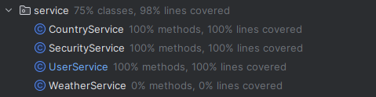

# Weather App

# What is it?

The Weather Application is a RESTful web service built using the Spring Framework. It provides users with the ability to retrieve weather information, manage their favorite cities, and perform various other weather-related operations.

## Sonar Cloud

[](https://sonarcloud.io/summary/new_code?id=BlackDaddy220232_Weather-App)
[](https://sonarcloud.io/summary/new_code?id=BlackDaddy220232_Weather-App)
[](https://sonarcloud.io/summary/new_code?id=BlackDaddy220232_Weather-App)

This project is integrated with the Sonor Cloud platform, which provides advanced code analysis and quality assurance tools to help us deliver high-quality, maintainable code.

## API Reference
### Postman
To interact with the "Weather Application" application's RESTful API endpoints, you can use the Postman request by this [link](https://www.postman.com/material-saganist-75818563/workspace/weather/overview?ctx=settings). Tap ```create a fork``` and use Postman for doing request.
#### Sign Up

```http
POST /auth/signup
```

| Body | Type     | Description                |
| :-------- | :------- | :------------------------- |
| `username` | `string` | **Required**. Nickname of user |
| `password` | `int` | **Required**. Password of user |
| `country` | `string` | **Required**. Country of user |

#### Edit Password

```http
PATCH /auth/editPassword
```

| Body | Type     | Description                |
| :-------- | :------- | :------------------------- |
| `password` | `int` | **Required**. New password |

#### Sign In

```http
POST /auth/signin
```

| Body | Type     | Description                |
| :-------- | :------- | :------------------------- |
| `username` | `string` | **Required**. Nickname of user |
| `password` | `string` | **Required**. Password of user |


#### Get users by countries

```http
GET /countries/getCountryUsers?countryName=${countryName}
```

| Parameter | Type     | Description                |
| :-------- | :------- | :------------------------- |
| `countryName` | `string` | **Required**.  Country |

#### Get countries
```http
GET /countries/getCountries
```

#### Edit country name
```http
PATCH /countries/editCountryName?countryName=${countryName}&newCountryName=${newCountryName}
```

| Parameter | Type     | Description                |
| :-------- | :------- | :------------------------- |
| `countryName` | `string` | **Required**. Old name of the country |
| `newCountryName`    |  `string`| **Required** New name of the country|

#### Delete country

```http
DELETE /countries/deleteCountry?countryName=${countryName}
```

| Parameter | Type     | Description                |
| :-------- | :------- | :------------------------- |
| `countryName` | `string` | **Required**. Name of the country to delete |

#### Get all users
```http
GET /users/getAllUsers
```
#### Delete user

```http
DELETE /users/deleteUser?username=${username}
```

| Parameter | Type     | Description                |
| :-------- | :------- | :------------------------- |
| `username` | `string` | **Required**. Username of user to delete |


#### Add city

```http
POST /users/addCity?city=${cityname}
```

| Parameter | Type     | Description                |
| :-------- | :------- | :------------------------- |
| `cityname` | `string` | **Required**. Name of the city to add |

#### Get all cities

```http
GET /users/getAllCities
```

#### Delete city

```http
DELETE /users/deleteCity?city=${cityname}
```

| Parameter | Type     | Description                |
| :-------- | :------- | :------------------------- |
| `cityname` | `string` | **Required**. Name of the city to delete |

#### Get user by username

```http
GET /users/getUserByUsername?username=${username}
```

| Parameter | Type     | Description                |
| :-------- | :------- | :------------------------- |
| `username` | `string` | **Required**. Username of the user |

#### Add some cities

```http
POST /users/addSomeCities?cities=${cityname1}&cities={cityname2}
```

| Parameter | Type     | Description                |
| :-------- | :------- | :------------------------- |
| `cities` | `string` | **Required**. Names of the cities |

## Prerequisites

- Java Development Kit (JDK) 17 or later
- Apache Maven 3.9.6

## Installation

#### 1. Clone the repository:
    
```bash
  git clone https://github.com/BlackDaddy220232/Weather-App.git
```

#### 2. Navigate into the cloned directory
```bash
cd Weather-App\src\main\resources
```
#### 3. Open ```application.properties```****

#### 4. Please provide your username and password, API key, JWT secket, duration of session in the designated fields.

#### 5. Choose ```create``` or ```create-drop``` in the field ```spring.jpa.hibernate.ddl-auto```.

#### 6. Open pgAdmin and create database with name ```BlogPlatform```

#### 7. Execute the Maven command to clean the project and then build it
```bash
mvn clean install
```
#### 8. run the application using the following Java command:
```bash
java -jar \target\Weather-0.0.1-SNAPSHOT.jar
```
## Technologies and Frameworks
The Weather Application is built using the following technologies and frameworks:

 * Spring Framework
   
 * Spring Security
   
* JWT (JSON Web Tokens)
  
* Unit Testing
* Logging and Aspect-Oriented Programming
* Caching
* Atomic Counters
* Spring Boot
## Configuration

You can customize the application's behavior by modifying the `application.properties` file located in the `src/main/resources` directory. In this file, you can configure settings such as the API key or API link for accessing the weather data.

## Tests

The service layer of the "Weather Application" application has **100% unit test coverage**. This means that every method and code path in the service layer is thoroughly tested, ensuring the correctness of the application's core functionality



## Security
This application implements several security measures to protect the weather API integration:

### Authentication and Authorization
The application uses JSON Web Tokens (JWT) for authentication and authorization. When a user logs in, the server generates a signed JWT token and sends it back to the client, which must include the token in the Authorization header for all subsequent requests.

***Before deploying the application, make sure to remove the return token; line from the Security Controller, as this would expose the JWT token directly in the response.***

### Secure Cookies
In addition to JWT tokens, the application also uses cookies to manage user sessions. The session cookies are marked as HttpOnly and Secure, ensuring they can only be accessed by the server and transmitted over HTTPS.
## Contributing

Contributions are welcome! If you find any issues or want to add new features, please submit a pull request.

## License

This project is licensed under the MIT License. See the `LICENSE` file for more information.

## Author

This application was developed by Alexander Mynzul.

